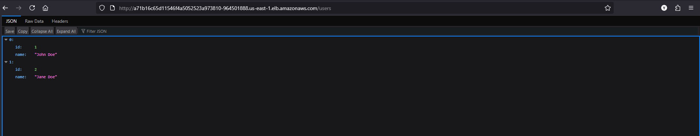
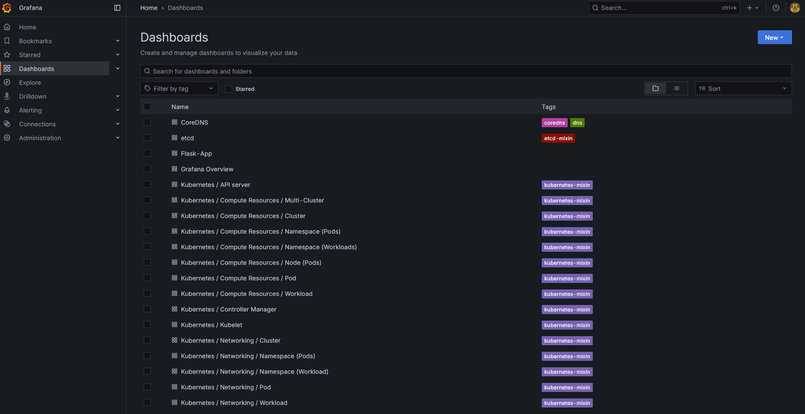
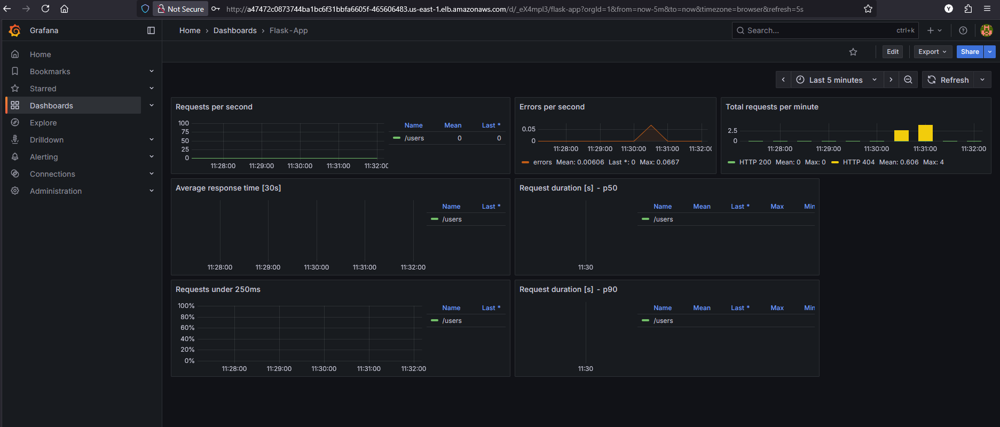
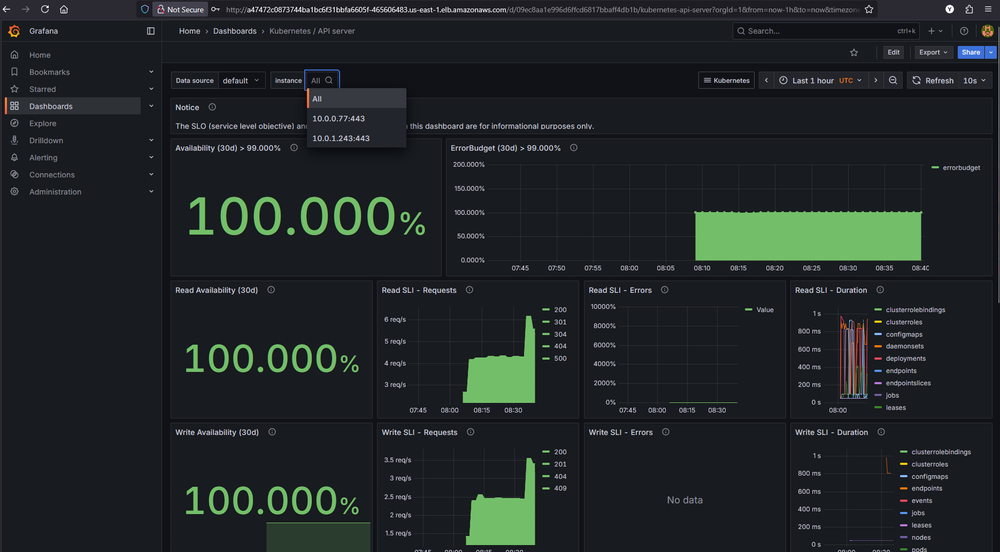
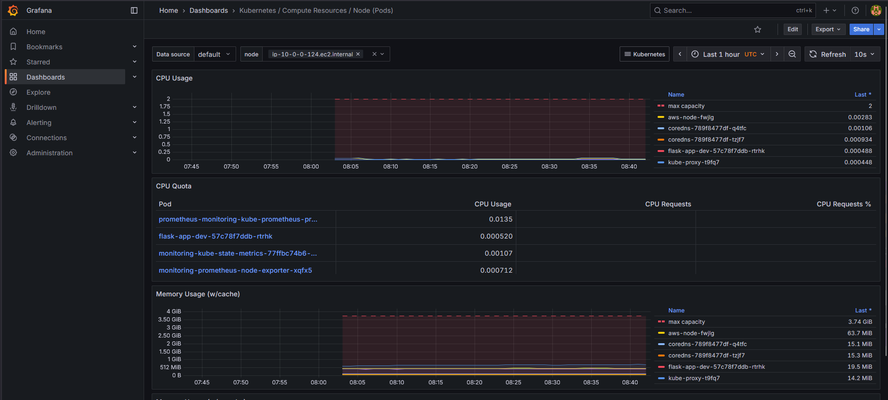

# Flask Application Deployment on AWS EKS

This project demonstrates a complete DevOps pipeline for deploying a Flask microservice application on Amazon EKS (Elastic Kubernetes Service) with comprehensive monitoring using Prometheus and Grafana. The infrastructure is provisioned using Terraform, and the entire deployment process is automated through GitHub Actions CI/CD pipeline.

## Pre-requisites

Before deploying this application, ensure you have the following prerequisites:

### AWS Requirements
- AWS CLI installed and configured with appropriate credentials
- An S3 bucket for tfstate backend ( manually created on console with versioning enabled)
- An AWS account with sufficient permissions to create EKS clusters, VPCs, IAM roles, and EC2 instances
- Create an OIDC for Github:
```
Provider URL: https://token.actions.githubusercontent.com
Audience: sts.amazonaws.com
```
- AWS IAM role configured for GitHub Actions with the following policies:
  - AmazonEKSClusterPolicy
  - AmazonEKSWorkerNodePolicy
  - AmazonEKS_CNI_Policy
  - AmazonEC2ContainerRegistryReadOnly
  - EC2 and VPC management permissions

### Development Tools
- Docker installed for local testing and image building
- kubectl CLI tool for Kubernetes cluster management
- Terraform (version 1.10.1 or compatible) for infrastructure provisioning
- Helm 3 for managing Kubernetes packages

### GitHub Repository Setup
- GitHub repository with the following secrets configured:
  - `AWS_ROLE_TO_ASSUME`: ARN of the AWS IAM role for GitHub Actions
  - `DOCKERHUB_USERNAME`: Docker Hub username
  - `DOCKERHUB_PASSWORD`: Docker Hub password
  - `DOCKERHUB_REPO`: Docker Hub repository name

### Local Development
- Python 3.8 or higher
- pip package manager
- Git for version control

## Project File Structure

```
Web_APP_Deployment_AWS/
├── .github/
│   └── workflows/
│       └── ci.yaml                 # GitHub Actions CI/CD pipeline
├── .gitignore                      # Git ignore patterns
├── Dashboards/
│   └── flask-app.json             # Grafana dashboard configuration
├── eks_deploy/
│   ├── deployment.yaml            # Kubernetes deployment manifest
│   ├── loadbalancer.yaml          # LoadBalancer service manifest
│   └── appmonitor.yaml            # ServiceMonitor for Prometheus
├── IaC/
│   ├── backend.tf                 # Terraform backend configuration
│   ├── main.tf                    # Main Terraform infrastructure code
│   ├── outputs.tf                 # Terraform output definitions
│   ├── providers.tf               # Terraform provider configurations
│   └── variables.tf               # Terraform variable definitions
├── microservices/
│   ├── Dockerfile                 # Container image definition
│   ├── requirements.txt           # Python dependencies
│   ├── run.py                     # Application entry point
│   └── app/
│       ├── __init__.py           # Flask application factory
│       ├── main.py               # Main application with Prometheus metrics
│       ├── routes/
│       │   ├── __init__.py
│       │   ├── product_routes.py # Product API endpoints
│       │   └── user_routes.py    # User API endpoints
│       └── services/
│           ├── __init__.py
│           ├── product_service.py # Product business logic
│           └── user_service.py    # User business logic

```

## IaC Provisioned Infrastructure

The Terraform configuration provisions the following AWS infrastructure:

### Network Architecture
- **VPC**: Custom Virtual Private Cloud (10.0.0.0/16)
- **Subnets**: Two public subnets across different availability zones for high availability
- **Internet Gateway**: Enables internet access for the EKS cluster
- **Route Tables**: Public routing configuration for external connectivity

### EKS Cluster Components
- **EKS Cluster**: Kubernetes version 1.31 with public endpoint access
- **Node Group**: Auto-scaling group with t3.medium instances (1-2 nodes)
- **IAM Roles**: Separate roles for cluster and node group with appropriate AWS managed policies

### Security Configuration
- **Authentication Mode**: CONFIG_MAP based access management
- **Network Security**: Public subnets with controlled access through security groups
- **IAM Policies**: Least privilege access for EKS operations

### AWS Resources Provisioned by Terraform
- **1x VPC** with CIDR block 10.0.0.0/16
- **2x Public Subnets** across different availability zones
- **1x Internet Gateway** for external connectivity
- **1x Route Table** with public internet routing
- **2x Route Table Associations** linking subnets to route table
- **1x EKS Cluster** (app_eks) running Kubernetes version 1.31
- **1x EKS Node Group** with auto-scaling configuration (1-2 t3.medium instances)
- **2x IAM Roles** (cluster role and node group role)
- **3x IAM Role Policy Attachments** for EKS permissions

## Deployment

The deployment process is fully automated through the GitHub Actions pipeline. Here's how to deploy:

### Automated Deployment
1. **Fork or Clone** this repository to your GitHub account
2. **Configure Secrets** in your GitHub repository settings:
   - Add all required secrets mentioned in the pre-requisites
3. **Push Changes** to any branch to trigger the pipeline
4. **Monitor Progress** through the GitHub Actions tab

#### For EKS management purposes, configure a temporary session for your user ( optional )
1. Add the below trust relationship in GitHub role so your user can assume it
```json
{
  "Effect": "Allow",
  "Principal": {
    "AWS": "<user_arn>"
  },
  "Action": "sts:AssumeRole"
}
```

2. Run the below commands in CloudShell
```bash
aws sts assume-role \
  --role-arn <github_role_arn> \
  --role-session-name console-session > creds.json
```

3. Create the below script:
```bash
#!/bin/bash

# Read credentials
export ACCESS_KEY=$(jq -r '.Credentials.AccessKeyId' creds.json)
export SECRET_KEY=$(jq -r '.Credentials.SecretAccessKey' creds.json)
export SESSION_TOKEN=$(jq -r '.Credentials.SessionToken' creds.json)

# Prepare session JSON
SESSION=$(cat <<EOF
{
  "sessionId": "$ACCESS_KEY",
  "sessionKey": "$SECRET_KEY",
  "sessionToken": "$SESSION_TOKEN"
}
EOF
)

# Get the sign-in token
TOKEN=$(curl -s -X GET "https://signin.aws.amazon.com/federation?Action=getSigninToken&Session=$(python3 -c "import urllib.parse, json; print(urllib.parse.quote('''$SESSION'''))")" | jq -r .SigninToken)

# Create login URL
LOGIN_URL="https://signin.aws.amazon.com/federation?Action=login&Issuer=Example.org&Destination=$(python3 -c "import urllib.parse; print(urllib.parse.quote('https://console.aws.amazon.com/'))")&SigninToken=$TOKEN"

echo "Login URL (valid for ~15 mins):"
echo "$LOGIN_URL"
```

4. Make it executable
```bash
chmod 700 <filename.sh>
./filename.sh
```

5. Use the temporary login url you will get to manage cluster 

### Manual Deployment Steps
If you prefer manual deployment:

1. **Infrastructure Provisioning**:
   ```bash
   cd IaC
   terraform init
   terraform plan
   terraform apply
   ```

2. **Docker Image Building**:
   ```bash
   cd microservices
   docker build -t your-repo/flaskapp:dev .
   docker push your-repo/flaskapp:dev
   ```

3. **Kubernetes Deployment**:
   ```bash
   aws eks update-kubeconfig --name app_eks --region us-east-1
   kubectl apply -f eks_deploy/
   ```

4. **Monitoring Setup**:
   ```bash
   helm repo add prometheus-community https://prometheus-community.github.io/helm-charts
   helm upgrade --install monitoring prometheus-community/kube-prometheus-stack \
     --namespace monitoring --create-namespace \
     --set grafana.service.type=LoadBalancer \
     --set prometheus.service.type=LoadBalancer
   ```

### Accessing the Application
After successful deployment:
- **Flask Application**: Access via the LoadBalancer URL (check kubectl get svc)
- **API Endpoints**:
  - GET /users - Retrieve all users
  - GET /users/{id} - Retrieve specific user
  - GET /products - Retrieve all products
  - GET /products/{id} - Retrieve specific product
  - GET /metrics - Prometheus metrics 



## Pipeline Explanation

The CI/CD pipeline consists of three main jobs that run sequentially:

### Job 1: EKS-Setup
**Purpose**: Provisions AWS infrastructure using Terraform
- **Triggers**: On push to any branch or PR to main
- **Steps**:
  1. Checks out the source code
  2. Configures AWS credentials using OIDC
  3. Installs Terraform CLI
  4. Initializes Terraform backend
  5. Generates and reviews execution plan
  6. Applies infrastructure changes

### Job 2: BuildImage-and-Publish-to-DockerHub
**Purpose**: Builds and publishes Docker image to registry
- **Triggers**: After EKS-Setup completes successfully
- **Steps**:
  1. Checks out source code
  2. Sets up Docker Buildx for multi-platform builds
  3. Authenticates with Docker Hub
  4. Builds Flask application image
  5. Tags image with repository information
  6. Pushes image to Docker Hub registry
- **Dependencies**: EKS-Setup job

### Job 3: Deploy-to-EKS
**Purpose**: Deploys application and monitoring to Kubernetes cluster
- **Triggers**: After BuildImage-and-Publish-to-DockerHub completes
- **Steps**:
  1. Installs kubectl CLI
  2. Configures AWS credentials
  3. Downloads kubeconfig for EKS cluster
  4. Installs Helm package manager
  5. Deploys Prometheus and Grafana monitoring stack
  6. Deploys Flask application to Kubernetes
  7. Verifies deployment status
  9. Provides elbs urls for ease of access
  10. Implements automatic rollback on failure
- **Dependencies**: BuildImage-and-Publish-to-DockerHub job

### Pipeline Features
- **Failure Handling**: Automatic rollback on deployment failures
- **Security**: Uses OIDC for secure AWS authentication
- **Monitoring**: Comprehensive logging and status reporting
- **Flexibility**: Supports both feature branch testing and production deployment

## Monitoring

The application includes comprehensive monitoring capabilities using the Prometheus and Grafana stack:

### Metrics Collection
- **Application Metrics**: Custom Flask metrics exposed at `/metrics` endpoint
- **Infrastructure Metrics**: Node and cluster metrics via node-exporter
- **Kubernetes Metrics**: Pod, service, and deployment metrics via kube-state-metrics

### Prometheus Configuration
- **Scrape Interval**: 15 seconds for application metrics
- **Service Discovery**: Automatic discovery of application endpoints
- **Data Retention**: Default Prometheus retention policies
- **Alerting**: Ready for custom alert rules configuration

### Grafana Dashboards
- **Pre-configured Dashboard**: Available in `Dashboards/flask-app.json`
- **Access Method**: LoadBalancer service for external access
- **Default Credentials**: admin/prom-operator (change after first login)
- **Data Sources**: Automatically configured Prometheus data source

### Monitoring Stack Components
1. **Prometheus Server**: Metrics collection and storage
2. **Grafana**: Visualization and dashboarding
3. **ServiceMonitor**: Kubernetes-native service discovery
4. **Kube-State-Metrics**: Kubernetes object metrics
5. **Node-Exporter**: System and hardware metrics

### Accessing Monitoring Tools
After deployment, get the external IPs:
```bash
kubectl get svc -n monitoring
```
- **Grafana**: Access via LoadBalancer IP on port 80
- **Prometheus**: Access via LoadBalancer IP on port 9090

### Importing Flask-App Dashboard
1. Go to Grafana's website
2. Dashboards --> New --> Import --> Upload Json File --> Import

### Key Metrics Monitored
- HTTP request rates and response times
- Application error rates and status codes
- Pod CPU and memory utilization
- Kubernetes deployment health
- Node resource consumption
- Network traffic and latency

The monitoring setup provides comprehensive observability for both the application performance and EKS cluster's components health.

### Monitoring Snippets
You should see something like this:








